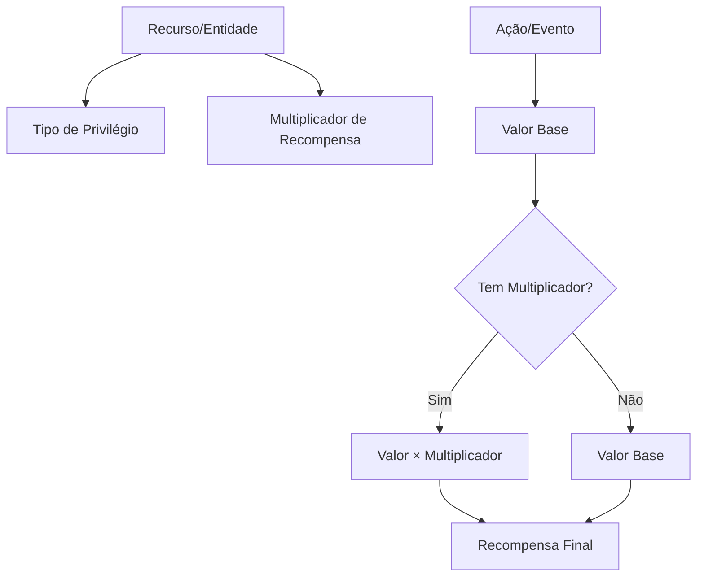

# 🎯 Template Universal: Sistema de Multiplicadores e Privilégios

## 📋 Visão Geral

Template **universal e reutilizável** para sistemas de multiplicadores de recompensas aplicáveis em:
- ✅ Plataformas de pontos (vídeos, ações sociais)
- ✅ E-commerce (cashback, programas de fidelidade)
- ✅ SaaS (créditos de uso, features premium)
- ✅ Games (XP, moedas, bonuses)
- ✅ Marketplaces (comissões, recompensas)

---

## 🏗️ Arquitetura Conceitual



---

## 🗃️ Estrutura do Banco de Dados (Universal)

### Tabela 1: `recursos_privilegiados`

```sql
CREATE TABLE `recursos_privilegiados` (
  `id` INT(11) AUTO_INCREMENT PRIMARY KEY,
  `recurso_id` VARCHAR(100) NOT NULL COMMENT 'ID do recurso (canal, produto, usuário, etc.)',
  `tipo_recurso` VARCHAR(50) NOT NULL COMMENT 'Contexto: youtube_channel, product, user, feature',
  `privilegio_tipo` ENUM('permanencia', 'bonus', 'vip', 'premium', 'destaque') NOT NULL,
  
  -- Controle de Permanência (opcional)
  `requer_pontos_manutencao` BOOLEAN DEFAULT FALSE COMMENT 'Precisa de pontos para permanecer?',
  `pontos_minimos_manutencao` INT DEFAULT 0,
  `sempre_visivel` BOOLEAN DEFAULT TRUE COMMENT 'Sempre aparece no sistema?',
  
  -- Multiplicadores (opcional)
  `multiplicador_padrao` DECIMAL(3,1) DEFAULT 1.0 COMMENT 'Multiplicador padrão para ações',
  `multiplicador_acoes_especificas` JSON DEFAULT NULL COMMENT '{"acao_1": 2.0, "acao_2": 3.0}',
  
  -- Temporalidade
  `data_inicio` DATETIME DEFAULT CURRENT_TIMESTAMP,
  `data_fim` DATETIME DEFAULT NULL COMMENT 'NULL = permanente',
  
  -- Status e Configuração
  `ativo` BOOLEAN DEFAULT TRUE,
  `prioridade_exibicao` INT DEFAULT 0,
  `destaque_visual` BOOLEAN DEFAULT FALSE,
  
  -- Metadados e Contexto
  `justificativa` TEXT,
  `beneficios_json` JSON COMMENT 'Lista de benefícios específicos',
  `metadata_contexto` JSON COMMENT 'Dados específicos do tipo de recurso',
  `observacoes` TEXT,
  
  -- Timestamps
  `data_cadastro` DATETIME DEFAULT CURRENT_TIMESTAMP,
  `data_atualizacao` DATETIME DEFAULT CURRENT_TIMESTAMP ON UPDATE CURRENT_TIMESTAMP,
  
  -- Índices
  UNIQUE KEY `unique_recurso_privilegio` (`recurso_id`, `tipo_recurso`, `privilegio_tipo`),
  KEY `idx_tipo_recurso` (`tipo_recurso`),
  KEY `idx_privilegio_tipo` (`privilegio_tipo`),
  KEY `idx_ativo` (`ativo`),
  KEY `idx_data_fim` (`data_fim`)
) ENGINE=InnoDB DEFAULT CHARSET=utf8mb4;
```

### Tabela 2: `config_multiplicadores_acoes`

```sql
CREATE TABLE `config_multiplicadores_acoes` (
  `id` INT(11) AUTO_INCREMENT PRIMARY KEY,
  `contexto_sistema` VARCHAR(50) NOT NULL COMMENT 'youtube, ecommerce, saas, game',
  `acao_tipo` VARCHAR(50) NOT NULL COMMENT 'subscribe, watch, purchase, review, use_feature',
  `valor_base` DECIMAL(10,2) NOT NULL COMMENT 'Valor base sem multiplicador',
  `unidade` VARCHAR(20) COMMENT 'pontos, creditos, xp, cashback_percent',
  `descricao` VARCHAR(255),
  
  UNIQUE KEY `unique_contexto_acao` (`contexto_sistema`, `acao_tipo`)
) ENGINE=InnoDB DEFAULT CHARSET=utf8mb4;
```

### View: `vw_recursos_privilegiados_ativos`

```sql
CREATE OR REPLACE VIEW `vw_recursos_privilegiados_ativos` AS
SELECT 
    rp.id,
    rp.recurso_id,
    rp.tipo_recurso,
    rp.privilegio_tipo,
    rp.multiplicador_padrao,
    rp.sempre_visivel,
    rp.requer_pontos_manutencao,
    rp.prioridade_exibicao,
    rp.destaque_visual,
    rp.data_inicio,
    rp.data_fim,
    rp.beneficios_json,
    CASE 
        WHEN rp.data_fim IS NOT NULL AND rp.data_fim < NOW() THEN 0
        ELSE rp.ativo
    END as ativo_real,
    -- Validação de permanência (se requer pontos)
    COALESCE(p.saldo_total, 0) as saldo_atual,
    CASE 
        WHEN rp.requer_pontos_manutencao = TRUE 
             AND COALESCE(p.saldo_total, 0) < rp.pontos_minimos_manutencao 
        THEN FALSE 
        ELSE TRUE 
    END as elegivel_permanencia
FROM recursos_privilegiados rp
LEFT JOIN (
    SELECT 
        recurso_id, 
        SUM(valor) as saldo_total
    FROM registro_pontos_atividades
    GROUP BY recurso_id
) p ON rp.recurso_id= p.recurso_id
WHERE rp.ativo = 1
ORDER BY rp.prioridade_exibicao DESC, rp.data_cadastro DESC;
```

---

## 🔧 Stored Procedures Universais

### Procedure 1: Gerenciar Privilégio

```sql
DELIMITER $$
CREATE PROCEDURE `sp_gerenciar_privilegio`(
    IN p_recurso_id VARCHAR(100),
    IN p_tipo_recurso VARCHAR(50),
    IN p_privilegio_tipo ENUM('permanencia', 'bonus', 'vip', 'premium', 'destaque'),
    IN p_multiplicador DECIMAL(3,1),
    IN p_sempre_visivel BOOLEAN,
    IN p_requer_pontos BOOLEAN,
    IN p_pontos_minimos INT,
    IN p_data_fim DATETIME,
    IN p_beneficios_json JSON,
    IN p_observacoes TEXT,
    OUT p_sucesso BOOLEAN,
    OUT p_mensagem VARCHAR(500)
)
BEGIN
    DECLARE v_recurso_existe INT DEFAULT 0;
    DECLARE v_nome_recurso VARCHAR(255);
    
    START TRANSACTION;
    
    -- Validação genérica (implementar conforme tipo_recurso)
    -- Exemplo: verificar se existe na tabela principal
    -- SELECT COUNT(*) INTO v_recurso_existe FROM recursos_principais WHERE id= p_recurso_id;
    SET v_recurso_existe = 1; -- Simplificado
    
    IF v_recurso_existe = 0 THEN
        SET p_sucesso = FALSE;
        SET p_mensagem = 'Recurso não encontrado no sistema.';
        ROLLBACK;
    ELSE
        -- Upsert: atualiza se existe, insere se não existe
        INSERT INTO recursos_privilegiados 
        (recurso_id, tipo_recurso, privilegio_tipo, multiplicador_padrao, 
         sempre_visivel, requer_pontos_manutencao, pontos_minimos_manutencao,
         data_fim, beneficios_json, observacoes, ativo)
        VALUES 
        (p_recurso_id, p_tipo_recurso, p_privilegio_tipo, p_multiplicador,
         p_sempre_visivel, p_requer_pontos, p_pontos_minimos,
         p_data_fim, p_beneficios_json, p_observacoes, TRUE)
        ON DUPLICATE KEY UPDATE
            multiplicador_padrao = p_multiplicador,
            sempre_visivel = p_sempre_visivel,
            requer_pontos_manutencao = p_requer_pontos,
            pontos_minimos_manutencao = p_pontos_minimos,
            data_fim = p_data_fim,
            beneficios_json= p_beneficios_json,
            observacoes = p_observacoes,
            ativo = TRUE;
        
        SET p_sucesso = TRUE;
        SET p_mensagem = CONCAT('Privilégio ', p_privilegio_tipo, ' configurado com sucesso!');
        COMMIT;
    END IF;
END$$
DELIMITER ;
```

### Procedure 2: Calcular Recompensa com Multiplicador

```sql
DELIMITER $$
CREATE PROCEDURE `sp_calcular_recompensa_com_bonus`(
    IN p_recurso_id VARCHAR(100),
    IN p_tipo_recurso VARCHAR(50),
    IN p_acao_tipo VARCHAR(50),
    OUT p_valor_base DECIMAL(10,2),
    OUT p_multiplicador DECIMAL(3,1),
    OUT p_valor_final DECIMAL(10,2)
)
BEGIN
    DECLARE v_valor_original DECIMAL(10,2) DEFAULT 0;
    DECLARE v_multiplicador DECIMAL(3,1) DEFAULT 1.0;
    
    -- Busca valor base da ação no contexto
    SELECT cm.valor_base INTO v_valor_original
    FROM config_multiplicadores_acoes cm
    WHERE cm.acao_tipo = p_acao_tipo
    LIMIT 1;
    
    -- Busca multiplicador do recurso (se existir)
    SELECT rp.multiplicador_padrao INTO v_multiplicador
    FROM recursos_privilegiados rp
    WHERE rp.recurso_id= p_recurso_id
      AND rp.tipo_recurso = p_tipo_recurso
      AND rp.ativo = 1
      AND (rp.data_fim IS NULL OR rp.data_fim > NOW())
    LIMIT 1;
    
    -- Se não tiver bônus, usa 1.0
    IF v_multiplicador IS NULL THEN
        SET v_multiplicador = 1.0;
    END IF;
    
    SET p_valor_base = v_valor_original;
    SET p_multiplicador = v_multiplicador;
    SET p_valor_final= ROUND(v_valor_original * v_multiplicador, 2);
END$$
DELIMITER ;
```

---

## 💻 Helper PHP Universal

```php
<?php
/**
 * Sistema Universal de Multiplicadores e Privilégios
 * Arquivo: config/sistema-privilegios-helper.php
 */

/**
 * Calcula recompensa com multiplicador aplicado
 * 
 * @param string $recurso_id ID do recurso
 * @param string $tipo_recurso Tipo: youtube_channel, product, user, etc.
 * @param string $acao_tipo Tipo de ação: subscribe, watch, purchase, etc.
 * @return float Valor final com multiplicador
 */
function calcular_recompensa_com_bonus($recurso_id, $tipo_recurso, $acao_tipo) {
    global $link;
    
    // Busca valor base
    $stmt = $link->prepare("
        SELECT valor_base 
        FROM config_multiplicadores_acoes 
        WHERE acao_tipo = ?
    ");
    $stmt->bind_param("s", $acao_tipo);
    $stmt->execute();
    $result = $stmt->get_result();
    
    if ($result->num_rows === 0) {
        $stmt->close();
        return 0;
    }
    
    $valor_base = floatval($result->fetch_assoc()['valor_base']);
    $stmt->close();
    
    // Busca multiplicador do recurso
    $stmt = $link->prepare("
        SELECT multiplicador_padrao
        FROM recursos_privilegiados
        WHERE recurso_id= ? 
          AND tipo_recurso = ?
          AND ativo = 1
          AND (data_fim IS NULL OR data_fim > NOW())
        LIMIT 1
    ");
    $stmt->bind_param("ss", $recurso_id, $tipo_recurso);
    $stmt->execute();
    $result = $stmt->get_result();
    
    $multiplicador = 1.0; // Padrão: sem bônus
    
    if ($result->num_rows > 0) {
        $row = $result->fetch_assoc();
        $multiplicador = floatval($row['multiplicador_padrao']);
    }
    $stmt->close();
    
    return round($valor_base * $multiplicador, 2);
}

/**
 * Verifica se recurso tem privilégio de permanência
 * 
 * @param string $recurso_id ID do recurso
 * @param string $tipo_recurso Tipo do recurso
 * @return array ['tem_privilegio' => bool, 'sempre_visivel' => bool, 'requer_pontos' => bool]
 */
function verificar_privilegio_permanencia($recurso_id, $tipo_recurso) {
    global $link;
    
    $stmt = $link->prepare("
        SELECT sempre_visivel, requer_pontos_manutencao, pontos_minimos_manutencao
        FROM recursos_privilegiados
        WHERE recurso_id= ? 
          AND tipo_recurso = ?
          AND privilegio_tipo = 'permanencia'
          AND ativo = 1
          AND (data_fim IS NULL OR data_fim > NOW())
        LIMIT 1
    ");
    $stmt->bind_param("ss", $recurso_id, $tipo_recurso);
    $stmt->execute();
    $result = $stmt->get_result();
    
    $resultado = [
        'tem_privilegio' => false,
        'sempre_visivel' => false,
        'requer_pontos' => false,
        'pontos_minimos' => 0
    ];
    
    if ($result->num_rows > 0) {
        $row = $result->fetch_assoc();
        $resultado = [
            'tem_privilegio' => true,
            'sempre_visivel' => filter_var($row['sempre_visivel'], FILTER_VALIDATE_BOOLEAN),
            'requer_pontos' => filter_var($row['requer_pontos_manutencao'], FILTER_VALIDATE_BOOLEAN),
            'pontos_minimos' => intval($row['pontos_minimos_manutencao'])
        ];
    }
    $stmt->close();
    
    return $resultado;
}

/**
 * Registra recompensa com multiplicador no banco
 */
function registrar_recompensa_com_bonus($recurso_id, $tipo_recurso, $acao_tipo, $usuario_id) {
    $valor_final = calcular_recompensa_com_bonus($recurso_id, $tipo_recurso, $acao_tipo);
    
    // Implementação específica do sistema...
    // Inserir na tabela de registro_pontos_atividades
}
?>
```

---

## 📚 Casos de Uso Múltiplos

### Caso 1: YouTube Subscriber Exchange

```sql
-- Configurar multiplicadores para ações
INSERT INTO config_multiplicadores_acoes 
(contexto_sistema, acao_tipo, valor_base, unidade, descricao)
VALUES
('youtube', 'subscribe', 2.0, 'pontos', 'Inscrição em canal'),
('youtube', 'watch_video', 2.0, 'pontos', 'Vídeo assistido'),
('youtube', 'unsubscribe', -4.0, 'pontos', 'Deixar de seguir');

-- Canal próprio (4x)
CALL sp_gerenciar_privilegio(
    'UC_SEU_CANAL',           -- recurso_id
    'youtube_channel',        -- tipo_recurso
   'bonus',                  -- privilegio_tipo
    4.0,                     -- multiplicador_padrao
    TRUE,                    -- sempre_visivel
    FALSE,                   -- requer_pontos
    0,                       -- pontos_minimos
    NULL,                    -- data_fim (permanente)
    '{"inscricao": 8, "video": 8}', -- beneficios_json
    'Canal oficial do administrador',
    @sucesso,
    @mensagem
);

-- Canal parceiro (3x)
CALL sp_gerenciar_privilegio(
    'UC_PARCEIRO',
    'youtube_channel',
    'bonus',
    3.0,
    TRUE,
    FALSE,
    0,
    NULL,
    '{"inscricao": 6, "video": 6}',
    'Parceiro estratégico',
    @sucesso,
    @mensagem
);
```

### Caso 2: E-commerce Loyalty Program

```sql
-- Configurar multiplicadores para e-commerce
INSERT INTO config_multiplicadores_acoes 
(contexto_sistema, acao_tipo, valor_base, unidade, descricao)
VALUES
('ecommerce', 'purchase', 1.0, 'cashback_percent', 'Cashback em compras'),
('ecommerce', 'review', 50.0, 'pontos', 'Review de produto'),
('ecommerce', 'referral', 1000.0, 'pontos', 'Indicar amigo');

-- Produto em destaque (2x cashback)
CALL sp_gerenciar_privilegio(
    'PROD_123',              -- recurso_id (produto)
    'product',               -- tipo_recurso
    'destaque',              -- privilegio_tipo
   2.0,                     -- multiplicador (2x cashback)
    FALSE,                   -- sempre_visivel (não se aplica)
    FALSE,                   -- requer_pontos
    0,
    DATE_ADD(NOW(), INTERVAL 30 DAY), -- promoção por30 dias
    '{"cashback": "2%", "frete": "gratis"}',
    'Produto em promoção - cashback dobrado',
    @sucesso,
    @mensagem
);

-- Cliente VIP (3x pontos em reviews)
CALL sp_gerenciar_privilegio(
    'USER_456',              -- recurso_id (usuário)
    'user',                  -- tipo_recurso
    'vip',                   -- privilegio_tipo
   3.0,                     -- multiplicador
    FALSE,
    FALSE,
    0,
    NULL,
    '{"review": "3x pontos", "suporte": "prioritario"}',
    'Cliente VIP - Gold Tier',
    @sucesso,
    @mensagem
);
```

### Caso 3: SaaS Platform Credits

```sql
-- Configurar multiplicadores para SaaS
INSERT INTO config_multiplicadores_acoes 
(contexto_sistema, acao_tipo, valor_base, unidade, descricao)
VALUES
('saas', 'feature_use', 1.0, 'creditos', 'Uso de feature'),
('saas', 'invite_user', 10.0, 'creditos', 'Convidar usuário'),
('saas', 'complete_profile', 5.0, 'creditos', 'Perfil completo');

-- Feature premium (4x créditos para quem usar)
CALL sp_gerenciar_privilegio(
    'FEATURE_ANALYTICS',     -- recurso_id (feature)
    'feature',               -- tipo_recurso
    'premium',               -- privilegio_tipo
   4.0,                     -- multiplicador
    FALSE,
    FALSE,
    0,
    NULL,
    '{"creditos": "4x", "badge": "premium"}',
    'Feature premium - ganha 4x créditos ao usar',
    @sucesso,
    @mensagem
);
```

### Caso 4: Gaming Platform XP Bonus

```sql
-- Configurar multiplicadores para games
INSERT INTO config_multiplicadores_acoes 
(contexto_sistema, acao_tipo, valor_base, unidade, descricao)
VALUES
('game', 'quest_complete', 100.0, 'xp', 'Completar quest'),
('game', 'daily_login', 50.0, 'gold', 'Login diário'),
('game', 'boss_kill', 500.0, 'xp', 'Derrotar boss');

-- Quest especial (3x XP)
CALL sp_gerenciar_privilegio(
    'QUEST_DRAGON_SLAYER',   -- recurso_id (quest)
    'quest',                 -- tipo_recurso
    'bonus',                 -- privilegio_tipo
   3.0,                     -- multiplicador
    FALSE,
    FALSE,
    0,
    DATE_ADD(NOW(), INTERVAL 7 DAY), -- Evento semanal
    '{"xp": "3x", "drop_rate": "+50%"}',
    'Quest de evento - 3x XP por 7 dias',
    @sucesso,
    @mensagem
);
```

---

## ⚙️ Customização para Novos Contextos

### Passos para Adaptar:

1. **Defina o contexto_sistema**: 'youtube', 'ecommerce', 'saas', 'game', etc.
2. **Cadastre as ações**: Quais ações geram recompensa?
3. **Defina valores base**: Quanto vale cada ação sem bônus?
4. **Configure privilégios**: Quais recursos têm bônus?
5. **Ajuste benefícios**: O que cada tipo de privilégio concede?

---

## ✅ Benefícios deste Template Universal

- ♻️ **Reutilizável**: Funciona em múltiplos domínios
- 🧩 **Flexível**: Adapta-se a diferentes regras de negócio
- 📦 **Auto-contido**: Tudo necessário em um só lugar
- 🔧 **Customizável**: Fácil extensão via campos JSON
- 📊 **Auditável**: Histórico completo de mudanças
- 🎯 **Performático**: Índices e views otimizadas

---

**Versão:** 1.0  
**Data:** 2026-03-09  
**Aplicação:** Multi-contexto (YouTube, E-commerce, SaaS, Games, etc.)
